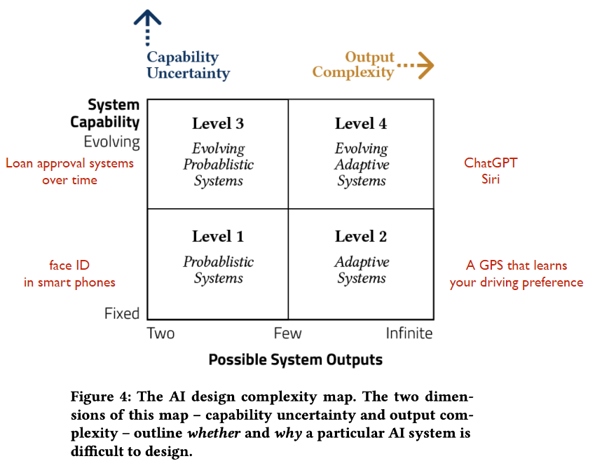

# Four Levels Of AI
NOTE: it needs technical knowledge to present the different level, hence it is not a focus in this subject

The four levels are designed in regards to design complexity

See the figure below for all four levels, the rest of this page will cover levels one and four

The levels might not be the important part, but the criteria for each level are

## Level One: Probabilistic Systems
- Learn from a self-contained dataset
- Produces a small fixed set of output
- E.g. face detection in camera apps

Can be designed these systems similarly to how non-AI probabilistic systems are designed, not likely to meet any challenges

- No challenges in understanding the AI system (for the designers)
- No challenges in envisioning a novel and technologically feasible design
- No challenges with iterative prototyping and testing
- No challenges in collaborating with engineers

## Level Two: Adaptive Systems

## Level Three: Evolving Probabilistic Systems
Give loan or not, but looking at previous data it could change when it gives out loans

## Level Four: Evolving, Adaptive Systems
- Learn from new data even after deployment
- Produces adaptive, open-ended outputs that resist abstraction
- E.g. search engines

- Challenges in understanding the AI system --> What it will do when it will fail (for the designers)
- Challenges in envisioning a novel and technologically feasible design
- No challenges with iterative prototyping and testing --> Hard because its functionality evolves over time
- No challenges in collaborating with engineers --> Higher than usual collaboration with engineers is required (traditional model: [[Double-Diamond Process]])
