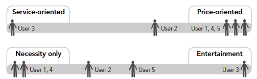

# Persona Construction
One possible method for creating [[Persona]]s. It has 7 steps

## 1. Identify Behavioral Variables
- **Behavioral variables** are distinct aspects of observed behavior crucial for developing effective user archetypes.
  - Focus on behavior over demographic variables like age or geographic location, as behavioral variables are more useful.
- Key types of behavioral variables to focus on:
  - **Activities**: What the user does, including frequency and volume.
  - **Attitudes**: How the user thinks about the product domain and technology.
  - **Aptitudes**: Education and training of the user, and their capability to learn.
  - **Motivations**: Why the user is engaged in the product domain.
  - **Skills**: User capabilities related to the product domain and technology.
- For **enterprise applications**, behavioral variables often align with job roles.
  - Suggested to list variables for each role separately.
  - Typical to find **15 to 30 variables** per role.
- Compare the **observed behavioral variables** with those anticipated in the persona hypothesis.
  - Check if the roles identified are distinct.
  - Validate the anticipated behavioral variables against data.
  - Note any unanticipated variables or ones that were expected but not supported by data.
- Adjust the set of behavioral variables based on data variance.
  - Add, subtract, or modify roles and behaviors as needed.
  - Significant variances may require additional interviews to explore new behavioral ranges.

## 2. Map Interview Subjects To Behavioral Variables
- Once the significant **behavioral variables** are identified, map each interviewee against these variables.
  - Variables can represent a **continuous range** (e.g., computer skills from novice to expert) or **multiple discrete choices** (e.g., digital vs. film camera users).
- **Precision in mapping** is less crucial than understanding the relative placement of interviewees to each other.
  - Focus on the **relative position** of subjects rather than pinpointing an exact percentage on a scale.
  - Rely on observations and **gut feeling** to determine an interviewee's placement.
- The goal is to accurately represent how subjects cluster concerning each significant variable.
  - **Clusters** across multiple axes reveal significant behavior patterns.
  - The precise absolute position of an individual is less important than its position relative to others.

## 3. Identify Significant Behavior Patterns
- Look for **clusters** of subjects across multiple behavioral variables after mapping interview subjects.
  - Clusters of **six to eight** variables typically indicate a significant behavior pattern.
  - These patterns form the basis of a **persona**.
- While some specialized roles might exhibit only one significant pattern, it's common to find **two or three** patterns.
- A pattern is considered **valid** if there is a **logical or causative connection** between the clustered behaviors.
  - Avoid mistaking spurious correlations for meaningful patterns.
  - Example of a valid connection: People purchasing CDs often download MP3 files.
  - Example of a likely spurious correlation: Online CD purchasers being vegetarians.

## 4. Synthesize Characteristics And Relevant Goals
- Synthesize details from data for each significant behavior pattern identified:
  - Describe the **potential use environment**, a typical workday, current solutions and frustrations, and relevant relationships.
- Keep descriptions to **brief bullet points** focusing on observed behaviors.
  - Include a description or two to **sharpen the personalities** of your personas, making them relatable.
  - Avoid excessive fictional details to maintain credibility.
- Remember, the goal is to create a **design tool**, not a character sketch.
  - Base personas on **concrete data** to support design and business decisions.
- Assign **first and last names** to personas:
  - Names should evoke the type of person the persona represents without resorting to stereotypes.
  - Use resources like a baby name book to choose appropriate names.
- Include some demographic information for visualization:
  - Age, geographic location, relative income, and job title, if relevant.
- Refer to personas by their names moving forward to personalize and solidify their presence in the design process.

### Synthesize Goals
- **Goals** are derived from analyzing behavior patterns and are critical for [[Persona]] development.
  - Identify by observing actions and analyzing responses to goal-oriented questions.
- Goals must relate to the product being designed, typically as [[End Goal]]s.
  - Expect three to five end goals per [[Persona]].
  - One [[Life Goal]] is appropriate for most [[Persona]]s, especially in consumer-oriented products or transient enterprise roles.
  - General [[Experience Goal]]s are almost implicit, with zero to two specific experience goals being appropriate.

### [[Persona]] Relationships
- Consider if personas should have interpersonal or social relationships, especially if:
  1. Behavioral variations were observed related to company size, industry, or family/social dynamics.
  2. Illustrating workflow or social interactions between personas is critical.
- Individual personas are usually unrelated and from different locations and social groups.
- Be cautious with personas in the same company or social circles to avoid limiting goal expression.
- Developing diverse personas may avoid bending scenarios to fit a single social dynamic.

## 5. Check For Redundancy And Completeness
- **Evaluate mappings, characteristics, and goals** for any significant gaps.
  - Additional research may be necessary to identify missing behaviors.
- **Review for political personas** needed to satisfy stakeholder assumptions or requests.
- **Assess for redundancy** among personas:
  - If two personas differ only by demographics, consider merging them or making their characteristics more distinct.
  - Each persona should be unique in at least one significant behavior pattern.
- **Ensure completeness and distinctiveness** of personas:
  - This guarantees a diverse representation of real-world behaviors and needs.
  - Aims for a compact design target to streamline the interaction design process.

## 6. Expand Description Of Attributes And Behaviors
- Transition from bullet points to **third-person narratives** to convey personas' attitudes, needs, and problems more effectively.
  - Narratives deepen the connection between designers and personas.
- **Persona descriptions** should synthesize key observations from research, contained within one or two pages of prose.
  - Aim to encapsulate the majority of user research findings.
  - Details should expand on the list of characteristics, incorporating data from observations and interviews.
- Include **fictional situations** to illustrate personas' daily life, including relevant peeves, concerns, and interests.
  - The narrative should conclude with what the persona seeks in the product.
- **Precision in detail**:
  - Ensure details do not exceed the depth of research to maintain credibility.
- **Use photographs** to make personas feel real:
  - Select images that capture demographic information, hint at the environment, and reflect the persona's general attitude.
  - Utilize stock photography databanks to find suitable pictures.
- **Photographic collages** can convey emotional and experiential aspects:
  - Juxtaposed images provide a powerful means to communicate complex forces driving a persona.
- Consider creating **models of the personas’ environments** (e.g., floorplans) to make environmental considerations tangible.
- **Personas as tools**:
  - Remember, personas are tools for design and decision-making, not an end in themselves.
  - Avoid excessive embellishments to maintain their effectiveness as user models.

## 7. Designate Persona Types
- Prioritize personas to determine the primary design target.
- Aim for a single interface that satisfies the primary persona without disenfranchising others.
- Six types of personas: **Primary, Secondary, Supplemental, Customer, Served, Negative**.

### Persona Types

#### Primary Personas
- The main target for interface design.
- Only one primary persona per interface, but products can have multiple interfaces for different primary personas.
- Designing for the primary persona should not dissatisfy other personas.

#### Secondary Personas
- Mostly satisfied with the primary persona’s interface but has additional needs.
- Accommodating these needs should not compromise the design of the primary persona.
- 3 or 4 secondary personas indicate a too-large or too-unfocused scope

#### Supplemental Personas
- Their needs are covered by the primary and secondary personas’ solutions.
- Often include political personas added to satisfy stakeholders.

#### Customer Personas
- Focus on the needs of customers, not end-users.
- In some cases, may be primary for their administrative interfaces.

#### Served Personas
- Not direct users but are affected by the product's use.
- Treated like secondary personas, they provide insight into the product's second-order social and physical ramifications.
- E.g. the person having radiation therapy performed, because they're not using the interface of the radiation machine

#### Negative Personas
- Specify user types the product is not designed to serve.
- Used rhetorically to communicate design targets to stakeholders and team members.

### Selection Process

- Choosing the primary persona involves testing each persona’s goals against others.
- A clear primary persona indicates a focused product scope.
- Multiple primary personas suggest a product may be too broad or require multiple interfaces.
- Accommodate secondary personas without disturbing the primary persona's needs.
