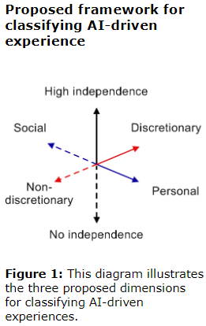

# The Framework
A framework for assessing AI-driven experiences. It has three dimensions

## Personal And Social Experiences
Individual users' experience of a smart camera vs studying the movement of crowds via a network of cameras. How can we best measure attitudes towards explainability and trust in each setting?

For a single user, a diary could be used but this doesn't scale well for crowds where an observational method could be used

TODO:
there is a difference between 
“surface-level” interactions (e.g., adaptive UIs) and AI 
techniques that shift social dynamics between people. 
There have been lessons learned from online social 
media, where a distinction is made between adaptive 
interaction elements and flows experienced by one 
user, and the experimental engineering of social 
relationships and relationship structures

## Discretionary vs. Non-Discretionary

### Discretionary
Temporary, task-based, non-committed experience, e.g. taking a picture with a smart camera (and using the image for translation)

Requires opt-in and the user ends the task

### Non-Discretionary
More enduring and doesn't require an opt-in, e.g. tracking of pedestrians in an intersection with a traffic light

## High Independence vs. No Independence
"The intelligent system’s level of independence within the interaction"

Classic systems usually have little independence within an interaction, while recommendation assistants have a higher degree of independence

## Example
Read the example from [[Adapting user experience research methods for AI-driven experiences.pdf]] (starts on page 5)
